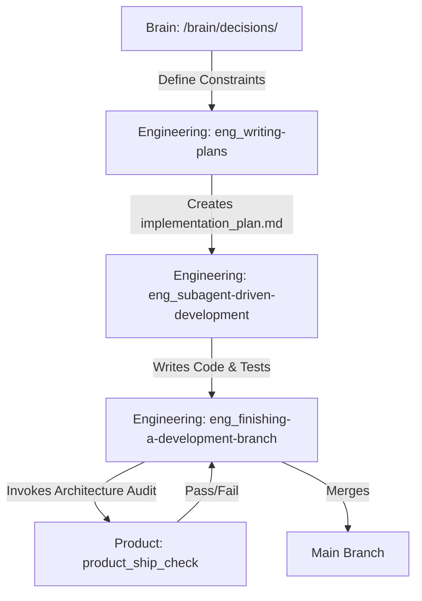

# SoloFounderFramework

O SoloFounderFramework é um ecossistema unificado para operação nativa no Antigravity 2.0. Ele une em um único ciclo síncrono a gestão de memórias, decisões de produto e a execução técnica por agentes, eliminando os atritos de transição entre papéis.

## A Linha de Montagem

A arquitetura do framework foi designada para operar como uma linha de montagem implacável. Os componentes não apenas existem lado a lado, mas exigem (hard-dependency) a execução uns dos outros de maneira fluída e obrigatória.

- **Brain (`/brain/`)**: O repositório central de contexto e memória longa do projeto. Armazena as decisões arquiteturais.
- **Product (`/skills/product/`)**: Os estrategistas que concebem a ideia, validam premissas e criam roadmaps e auditorias.
- **Engineering (`/skills/engineering/`)**: Os engenheiros de software focados em Test-Driven Development e construção técnica.

### Fluxo Síncrono de Trabalho

A operação obedece ao seguinte pipeline de handoff automatizado, que integra Memória, Estratégia e Execução:

## Como Usar

O manifesto único `gemini-extension.json` já expõe as ferramentas para a sessão do Antigravity. Todos os agentes que entrarem na workspace saberão instintivamente:

1. Que planos técnicos (`eng_writing-plans`) não podem ser escritos sem uma inspeção prévia de `/brain/decisions/`.
2. Que merges (`eng_finishing-a-development-branch`) estão bloqueados e exigem auditoria do estrategista (`product_ship_check`).
