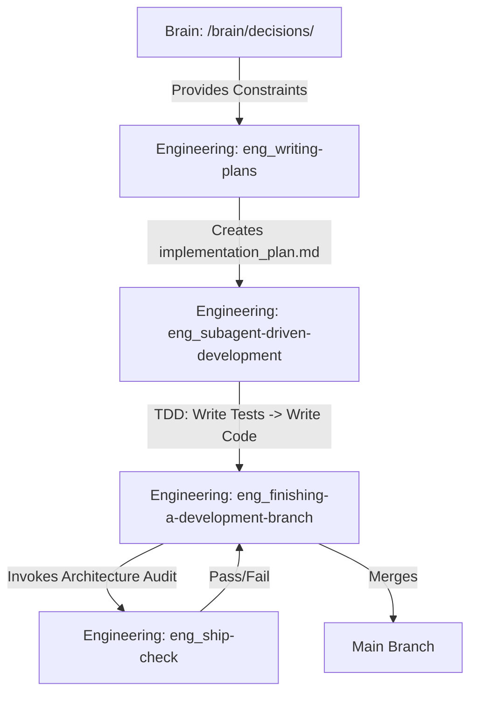

# SoloFounderFramework

The SoloFounderFramework is a native agentic plugin for Antigravity 2.0. It acts as a unified assembly line integrating Memory (Brain), Strategy (Product), and Execution (Engineering) into a single synchronous loop, transforming the AI assistant into an autonomous product and engineering operator.

## Overview

Traditional AI coding assistants treat each session as a blank slate or rely on shallow context windows. This framework replaces fragmented tooling with a durable, stateful operator that executes the entire software development lifecycle—from user interviews to test-driven deployment.

The architecture enforces strict boundaries and hard-dependencies between roles:
- **Brain (`/brain/`)**: The persistent knowledge base and memory layer. It stores raw insights, durable decisions, hypotheses, and stakeholder contexts.
- **Product (`/skills/product_*`)**: The compute layer for strategy. Product skills run discovery, evaluate risks, generate roadmaps, and triage feature requests.
- **Engineering (`/skills/eng_*`)**: The execution layer. Engineering skills write technical implementation plans, enforce strict Red-Green-Refactor Test-Driven Development (TDD), and audit the codebase for security and performance.

## The Assembly Line Workflow

The operation follows an automated handoff pipeline ensuring strategy drives execution, and execution is strictly verified.

## Core Principles

1. **Epistemic Integrity (Provenance):** The Agent must link all claims and ingested insights back to raw `/source/` files. The Brain cannot hallucinate strategy.
2. **Strict Test-Driven Development:** No production code is written without a failing test first. `eng_test-driven-development` strictly enforces the Red-Green-Refactor protocol.
3. **Explicit Guardrails:** The agent must halt and request human approval before creating an implementation plan or modifying source code.

## System Documentation

For detailed technical specifications, refer to the reverse-engineered system documents in `/documentation/`:

- [Architecture](documentation/architecture.md) — System overview, stack, auth flow, and trust boundaries.
- [Flows](documentation/flows.md) — Permission-relevant journeys, ingestion paths, and execution flows.
- [Permissions](documentation/permissions.md) — Human vs. Agent roles and resource access matrices.
- [Variables](documentation/variables.md) — Context budgets and configuration limits defined in `AGENTS.md`.
- [Automation](documentation/automation.md) — Embedded workflows for Brain Processing and Engineering Execution.
- [Test Coverage Map](documentation/tests.md) — Proposed CI gates and internal framework validation rules.

## Getting Started

1. Ensure you are running the Antigravity 2.0 Agent environment.
2. Install this plugin into your global or workspace customizations root (e.g., `~/.gemini/config/plugins/SoloFounderFramework`).
3. The Antigravity agent will automatically discover the `plugin.json` and internalize the workflows.
4. Interact with the agent using natural language (e.g., *"Let's build a new feature"*), or invoke explicit commands (e.g., `/brain_ingest`, `/eng_writing-plans`) to trigger specialized workflows.
