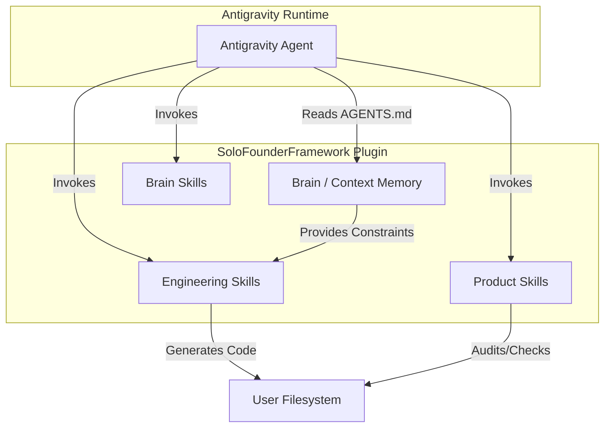

# Architecture: SoloFounderFramework

## System Overview
The SoloFounderFramework is a native agentic plugin for Antigravity 2.0. It acts as a unified assembly line integrating Memory (Brain), Strategy (Product), and Execution (Engineering) into a single synchronous loop. 

It is designed as a local execution framework running inside the user's filesystem and orchestrated by the Antigravity agent, replacing fragmented AI coding assistants with a continuous, stateful product operator.

## Tech Stack
- **Execution Environment**: Antigravity 2.0 Agent runtime
- **Configuration**: Local filesystem (`~/.gemini/config/plugins/SoloFounderFramework`)
- **Knowledge Base**: Native markdown files (no vector databases or embeddings)
- **Skills Architecture**: Hierarchical directory of Markdown-based instructions with YAML frontmatter

## Architecture Diagram

## Trust Boundaries
- **Agent ↔ Local Filesystem**: The agent has extensive read/write permissions within the local workspace. The boundary lies in the context budget constraints defined in `AGENTS.md` to prevent runaway reads.
- **Agent ↔ LLM API**: Context is sent to the LLM backend. Sensitive data handling is governed by explicit non-goals (e.g., avoiding PII scraping).
- **Execution ↔ Side Effects**: The agent uses native tools (like `run_command` or MCP servers) to interact with the broader OS, which is the primary operational boundary.

## Known Risks & Assumptions
1. **Context Bloat**: The framework assumes the agent will strictly follow the context budget defined in `brain/AGENTS.md` ("Context budget"). Runaway context loading can degrade reasoning.
2. **Provenance Drift**: Relies heavily on the agent correctly tagging origins of information (e.g., `[ingestion/...]`). Failure to do so corrupts the epistemic integrity of the brain.
3. **Execution Safety**: The agent executes bash commands to manage files and run tests. It assumes a relatively sandboxed or safe developer environment.

## Related Documents
- [Flows](./flows.md)
- [Permissions](./permissions.md)
- [Variables](./variables.md)
- [Automation](./automation.md)
